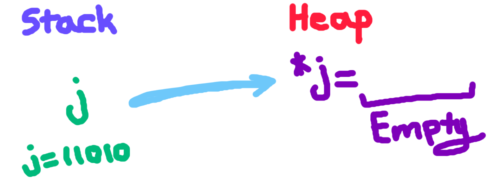

# Memory Allocation and C

In C we use the **malloc()** function to reserve and allocate memory ahead of time.


*Why do we use malloc?*: 
- We can use memory effectively and sparingly while still avoiding errors that may be caused by insufficient memory.

---

## Malloc vs Traditional Initialization

The malloc function is in the stdlib header file and allocates runtime memory (the heap) as opposed to the stack.

Traditional declaration initializes values onto the stack

```
int i;
```

When I give the variable a value then values may get put in the heap if needed.

```
int i = 2013;
```

If we utilize malloc to a similar effect we would code:

```
int* j = malloc(sizeof(int));
```

In the line above there are two chunks of data being stored. The pointer gets stored on the stack, (the value of j shows you a stack address), and the memory it points to is some reserved piece in the heap.

Ex: 

If we want to free up that memory (basically empty it out), we call the free() function on any pointer that points to the allocated chunk of memory.

- Note that the free() method **does not reset the values held by the initial pointer, those values remain untouched. Instead it simply dereferences that memory (makes it so that the pointer variable does not point there anymore)**.

```
int* j = malloc(sizeof(int));
int* k = j;
*k = 100;
free(k);
```

When we call free on the pointer k, does the pointer j also get "freed"?: No.

**C is not intelligent, when we call free on some pointer that pointer and only that pointer is released.**

- In more complex situations where pointers point to pointers which point to some data, freeing some pointers and not others can lead to unpredictable behavior.

- **If you wanna free() memory, then be extra safe and call free() on every pointer!**

---

## Arrays with malloc()

Keep in mind that the pointers can be of any type, just ensure that the allocated space is the same as the size of the data type.

If we want to allocate space for a string that consists of 10 characters, how would we do it?:

```
char* newString = malloc(10*sizeof(char));
```

**We need to multiply the allocated space by 10, because the sizeof() function returns the # of bytes for one char (i.e. 1), we have to multiply this value by the number of chars we intend to store.**

Remember that **malloc() returns a pointer, but more specifically a VOID pointer** (or NULL if there is no space available).

You may be told to cast the return type to the desired pointer type, but with newer versions of C this should not pose a problem.

Here's how you would wanna be typesafe (if needed):

```
char* newString = (char*) malloc(10*sizeof(char));
```

Keep in mind that malloc simply reserves bytes, but it does not initialize or reassign any values in memory!

**In other words, after using malloc() to allocate space for an array, the values in that array may be completely random and unpredictable!**

Before you use the array, make sure to initialize it!

In what cases could malloc fail?:

- Keep in mind that if the value returned by malloc is null it is an indication that the programmer has run out of memory (on the dynamic heap).

---

## When malloc() and free() are used (by the system)

The information below is sourced from:
https://learn.microsoft.com/en-us/cpp/c-runtime-library/reference/malloc?view=msvc-170

**When malloc(n) is called, *at least* n bytes are reserved, but more might be required for alignment and maintainence!**

- The malloc() function is actually used by the system to allocate storage for _environ, envp, and argv variables.

- In any C program or any program that eventually compiles in C, memory is typically released using the free() method after the program terminates.

---

## Utility Functions: realloc(), calloc(), memcpy()

The calloc() function is a modernized replacement for the malloc() function. **The main difference is that the calloc() function initializes the memory that the pointer reserves to 0.**

The format of the calloc function:

```
V* ptr = calloc(n, sizeof(struct V))
```

**This allocates enough space for n objects which each have the size of V (in bytes), and initializes the value of each reserved byte in memory to 0.**

- calloc returns a memory address corresponding with the first index of the reserved portion of memory (just like malloc()).

The realloc() function changes the size of the underlying object that a particular pointer points to. This would be useful if you wanted to generate a different type version of a pre-existing pointer (e.g. char -> 1 byte size per element, int -> 4 bytes size per element).

- **Ex. If you wanted to read and iterate through an array of ints but wanted to interpret the array as a bunch of character!**

The format of the realloc() function:

```
void * realloc( void * ptr, size_t size);
```

**The realloc function returns a new, changed pointer that still points to the same location as the original pointer, but points to a different sized chunk of data.**

- This affects pointer arithmetic, i.e. how you traverse the data after the pointer as if it was an array.

The memcpy() function is used to change the values of a dynamically initialized chunk of memory. 

The format of the memcpy() function:

```
memcpy(dest_ptr, src_ptr, len)
```
Where the dest_ptr is a pointer to the location in memory (stack or dynamic heap) you want the data to get copied to. The src_ptr is the pointer of the starting index of
whatever data you want to copy over. 

- When copying over an array, the src and dest pointers are typically just the array names.

**The len variable is asking how many bytes after the src pointer you want to copy over to the dest pointer's address. If the len argument is 0, then NOTHING gets copied. (If you wanted to copy only the first 4 ints over, len = 4*sizeof(int))**

Here is an example from tutorialspoint:

```

#include <stdio.h>
#include <string.h>

int main () {
   const char src[50] = "https://www.tutorialspoint.com";
   char dest[50];
   strcpy(dest,"Heloooo!!");
   printf("Before memcpy dest = %s\n", dest);
   memcpy(dest, src, strlen(src)+1);
   printf("After memcpy dest = %s\n", dest);
   
   return(0);
}

```

*Why are we adding +1 to the length argument?*: 

- Recall that strlen() gives us the number of bytes / characters
  in a string but excludes the null byte. To properly copy over
  the string we need to include the null byte, hence the length
  should be 1 more than what strlen() returns to accomplish this!

---


