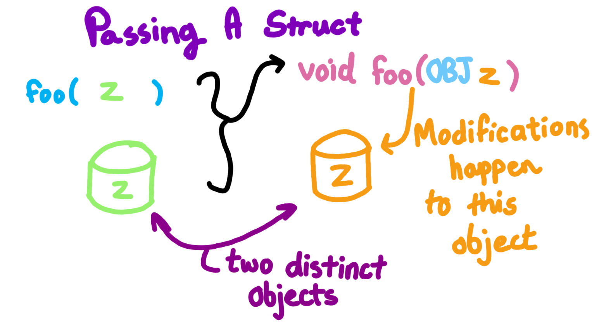
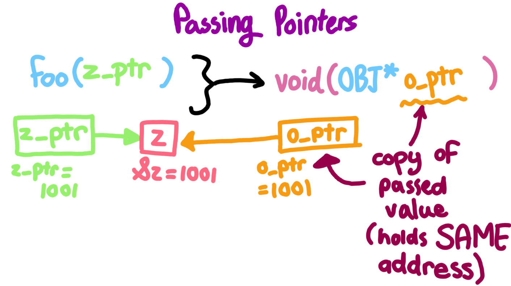

# Chapter 5: Arrays and Pointers

How to declare an array in C:

```
double arr[20];
```

When declaring an array the size MUST be some fixed constant!
Why is C this restrictive? C allocates memory for the program
ahead of time (in compile time) instead of runtime (which
would be after you hit play). 

- **The variable x will not have a value until runtime, 
    so we cannot use it to make an array in compile time 
    (we need to know the space constraint before runtime, 
    i.e. during compile time, this is not possible if
    the size is a variable whose value is undetermined 
    during compile time)**.

So the following code WILL NOT COMPILE:

```
foo(int x){
    char invalid_array[x];
}
```

---

## Multidimensional Arrays

C also supports multidimensional arrays which can be declared like so:

```
char a_few_strings[10][5];
int matrix[5][5][5];
```

Recall that memory is best visualized as a 1D linear array,
so how is a multidimensional array mapped into a linear memory mapping?

**C uses a row major alignment. What does this mean?:**

Suppose a 2D array: arr[rows][cols] where rows = 2, cols = 3

- Values in memory will be grouped based on the rows index.

The underlying memory array be arranged like so:

**arr[0][0], arr[0][1], arr[0][2], arr[1][0], arr[1][1], arr[1][2]**

Anything more than 2 dimensional arrays are uncommon, but the main
point is that any n dimensions can and have to ultimately mapped into
a 1 dimensional memory. If you want more flexibility on how to arrange
n dimensions, a better option may be to initialize a 1D array
and impose requirements and functions that allow us to interpret
the 1D array as a multidimensional array.

**Here is how a hypothetical 3D array would be mapped 
(from least significant memory address to the 
most significant memory address):**

Suppose the array: matrix[2][3][4]

matrix[0][0][0], matrix[0][0][1], matrix[0][0][2], matrix[0][0][3],
matrix[0][1][0], matrix[0][1][1], matrix[0][1][2], matrix[0][1][3],
matrix[0][2][0], matrix[0][2][1], matrix[0][2][2], matrix[0][2][3],

matrix[1][0][0], matrix[1][0][1], matrix[1][0][2], matrix[1][0][3],
matrix[1][1][0], matrix[1][1][1], matrix[1][1][2], matrix[1][1][3],
matrix[1][2][0], matrix[1][2][1], matrix[1][2][2], matrix[1][2][3],

---

## Declaring Pointers

Suppose we make an array of 5 elements, and then want
to assign a pointer to the third element in the array.

Here is how we would do it:

```
int arr[5], *int_ptr;
int_ptr = &arr[2];
```
What confuses people is that the __*__ operator can be used in two ways.

1) The operator is used to declare a pointer as part of the type declaration
   for the variable.
2) The operator can be used on a pointer to get and modify the value of the
   underlying value that the pointer points to.

Ex: Following off the previous example here is how I would modify the
third value in the array 

```
*int_ptr = 69420;
```

However, the __&__ operator is simply only used to get the address of a variable.
This variable could be a pointer in itself. And since pointers store addresses,
pointers are typically initialized with __&__ on the right hand side.

Ex: We can make a pointer to a pointer! Then we can dereference the pointer
twice (the first dereference gives us the value in the original pointer,
the second dereference gives us the value that this pointer points to).

```
int arr[5], *int_ptr;
int_ptr = &arr[2];
int * ptr_to_ptr = &int_ptr

**ptr_to_ptr = 69420
```

---

## Passing Pointers as Parameters!

Keep in mind that C is classified as "pass by value", but most people
get annoyed at this notation!

Some will say that Java is "pass by reference" and try to muddle you
in semantics between other languages and C.

Here is what I have to say to hopefully simplify things.

In Java when you pass an OBJECT into a method, what are you actually passing?:

- Are you passing the entirety of an object, or a mere reference to the object
  in memory? 
- **Java passes references in place of objects, imagine how slow the language
  would be if we kept passing whole ass objects from method to method!**
- This means in Java you don't have to think about pointers and memory and
  the headaches it entails.

In C when you pass a value into a function no matter what it is you are
literally passing the value!:

- The value that you use internally in a function is a **copy** of the passed
  value regardless of what that value is (both in Java and C) this is why
  people still argue Java is "pass by value", because the object reference 
  that you use inside of the method itself has a value.

- If we passed in a struct into a function into C with the hopes of modifying
  a struct outside the scope of the function, could we? NO! **The struct inside
  the function is a copy of the struct that you passed. Modifying the
  copy does not magically modify the original!**

- How do we fix this if we are intent on modifying something outside the scope
  of the function? **We pass a reference, i.e. a pointer to the struct or array
  or whatever we are trying to modify. The function gets a copy of the pointer,
  but that copy still points to the same underlying piece of data regardless
  of the scope we are in! Therefore we can use that copy of the pointer to
  modify values external to the function!**

If you still do not get it, I suggest drawing it out pictorally like so:

Here is what happens when we pass the struct itself:





KEY HERE: **Since the pointer's copy points to the same object as the
passed pointer, we can effectively modify the underlying object by dereferencing
the pointer.**

---